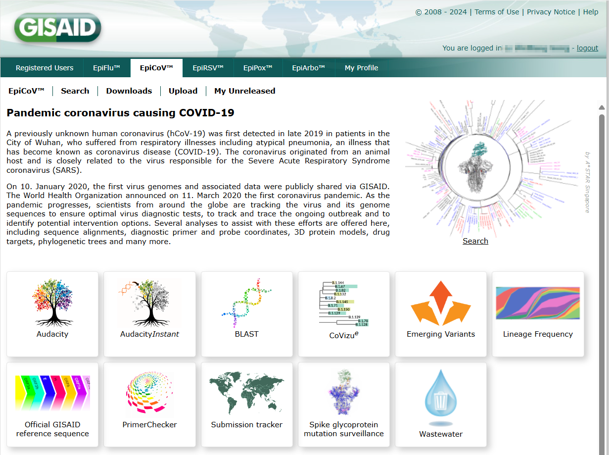
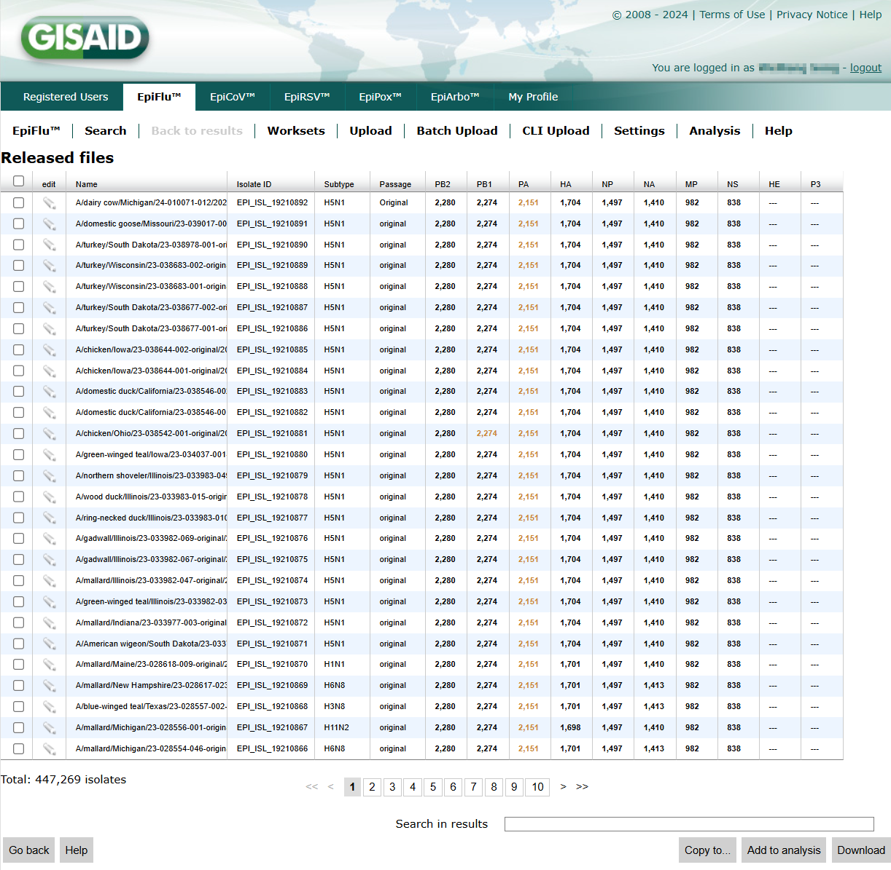
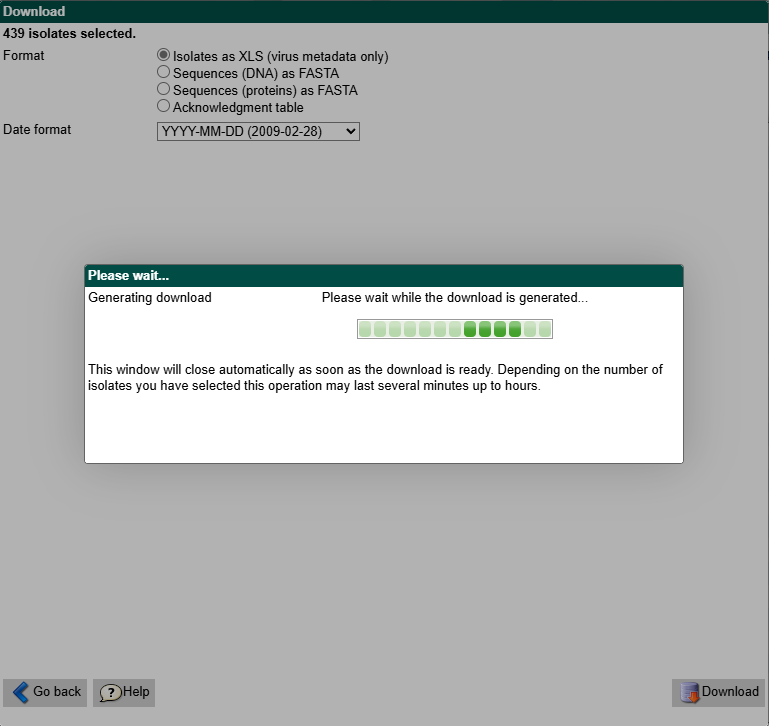

# 基本规则

- sid: session id, 在一次会话中保持不变
- wid: window id，平铺窗口共享同一个 wid，弹出的上层窗口（如下载）使用不同的 wid
- pid: page id，页面 id，更换检索条件会变化
- cid: component id，组件 id，许多函数需要传入 cid
- ceid: component event id，作为请求参数使用
- ts: time stamp

GISAID 获取参数依赖 POST 或 GET 请求。常将函数命令连接为 pipeline，转化为请求参数发送给服务器，在响应中包含目的页面的 pid，或页面的 HTML

获取数据展示在 result page 的`GetData`，系统限制一次最多访问 27 条数据，超出这个数字的需要分 batch 获取

# 动态 pid 案例

分析 browse page 到 result page 的流程，发现会调用`search, GetData, GoBack`三个命令，其中在两次检索中，browse page 的 pid 保持不变，而 result page 的 pid 会变化

```
{"queue":[{"wid":"wid_sf13al_7vm3","pid":"pid_sf13al_8ttf","cid":"c_sf13al_14b","cmd":"search","params":{},"equiv":null}]}
{"queue":[{"wid":"wid_sf13al_7vm3","pid":"pid_sf13al_95tz","cid":"c_sf13al_14h","cmd":"GetData","params":{}}]}
{"queue":[{"wid":"wid_sf13al_7vm3","pid":"pid_sf13al_95tz","cid":"c_sf13al_14j","cmd":"GoBack","params":{},"equiv":null}]}

{"queue":[{"wid":"wid_sf13al_7vm3","pid":"pid_sf13al_8ttf","cid":"c_sf13al_14b","cmd":"search","params":{},"equiv":null}]}
{"queue":[{"wid":"wid_sf13al_7vm3","pid":"pid_sf13al_9646","cid":"c_sf13al_14h","cmd":"GetData","params":{}}]}
{"queue":[{"wid":"wid_sf13al_7vm3","pid":"pid_sf13al_9646","cid":"c_sf13al_14j","cmd":"GoBack","params":{},"equiv":null}]}
```

分析 result page 到 download page 的流程（以选择 protein 为例），发现会调用`Download, ShowProteins, Cancel`三个命令，其中在两次唤起下载面板中，result page 的 pid 保持不变，而 download page 的 pid 会变化。注意，两次打开 download page 时，对应的上层 wid 也变了，而 cid 和 ceid 不变

```
{"wid":"wid_sf13al_7vm3","pid":"pid_sf13al_9cxb","cid":"c_sf13al_14j","cmd":"Download","params":{},"equiv":null}
{"wid":"wid_sf13al_9cxt","pid":"pid_sf13al_9cxu","cid":"c_sf13al_14m","cmd":"ShowProteins","params":{"ceid":"ce_sf13al_dm"},"equiv":null}
{"queue":[{"wid":"wid_sf13al_9cxt","pid":"pid_sf13al_9cxu","cid":"c_sf13al_14m","cmd":"Cancel","params":{},"equiv":null}]}

{"wid":"wid_sf13al_7vm3","pid":"pid_sf13al_9cxb","cid":"c_sf13al_14j","cmd":"Download","params":{},"equiv":null}
{"wid":"wid_sf13al_9d1x","pid":"pid_sf13al_9d1y","cid":"c_sf13al_14m","cmd":"ShowProteins","params":{"ceid":"ce_sf13al_dm"},"equiv":null}
{"queue":[{"wid":"wid_sf13al_9d1x","pid":"pid_sf13al_9d1y","cid":"c_sf13al_14m","cmd":"Cancel","params":{},"equiv":null}]}
```

# 函数细节

## gisflu.login()

- 登录 GISAID
- 进入 browse page 并解析元素 id
- 不做任何参数筛选，进入 result page 并解析元素 id。此时 result page 包含所有 records，选择一个临时记录，获取 download page 的 id
- 进入 download page 并解析元素 id
- 返回 browse page。如果没有该步骤，后续构造的请求会返回空值

## gisflu.search()

- 在 browse page 传入参数搜索
- 进入 result page，获取 records 的 json，转为 pandas 格式
- 返回 browse page。如果没有该步骤，后续构造的请求会返回空值
- 目前无法便捷地仅获取`isolateIds`（像 EpiCoV 数据库一样）。这是因为流感后端没有在 result page 实现`Selection`方法，无法调出一个对话框展示目前选中的`isolateIds`。流感数据库正在测试 browse page 的`ShowSelectDialog`方法，作用是根据用户输入的 `isolateIds` 列表做选择，但无法从选择获取`isolateIds`列表

## gisflu.download()

- 在`gisflu.login()`登录后即可使用，不需要预先调用`gisflu.search()`
- 根据`isolateIds`下载
- 不做任何参数筛选，进入 result page 并解析元素 id
- 勾选需要的`isolates`
- 进入 download page，选择下载`metadata, protein, dna`
- 设置 fasta header
- 获取下载链接
- 保存到本地

# 页面介绍

访问`https://platform.epicov.org/epi3/frontend`后，首先进入 login page


登录后进入 first page，默认为 EpiCoV 数据库



通过导航栏切换到 Flu 数据库，进入 home page


点击`Search`进入 browse page


设置 filter 条件，点击`Search`进入 result page



勾选需要下载的 records，点击`Download`进入 download page。该页面通过 Overlap Window 呈现


在下载 metadata 时，如果待下载的 records 较少，会直接启动下载；如果太多，会进入 downloadWait page



# 待办

- 重构`buildDownloadCommand`，应用到`gisflu.login()`和`gisflu.login()`

- 增加`location`到`gisflu.search()`

- 允许同时下载`metadata, protein, dna`，并保存到不同文件

- 从 browse page 自动获取 host code
